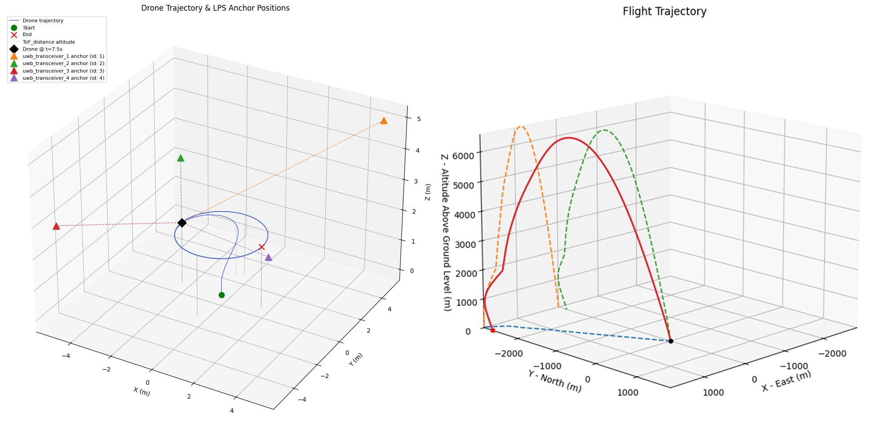

# Simulation and Evaluation

This readme describes the prerequisites and setup for running the simulation developed during the thesis.



> **Note:** All notebooks in this repository were developed using PyCharm Professional. Running them in VS Code or a browser-based Jupyter instance may cause path resolution issues.

## Prerequisites

- PyCharm Professional (Community edition may only provide limited support for running Jupyter notebooks)
- Python 3.14+
- Rust toolchain (for building the EKF module)
- maturin (installed in Python venv)

## Installation

**1. Set up the Python environment**

This can be done via terminal or via PyCharm. The following commands can be used to set up a virtual environment and activate it:

```bash
python -m venv .venv
.venv\Scripts\activate   # Windows
pip install -r requirements.txt
```

Note: this will also install maturin inside the virtual environment.

**2. Build and install the Rust EKF module**

From the repository root:

```bash
cd ekf
maturin develop --features python
```

## Simulation Structure

```
src/
  notebooks/            # simulation and evaluation notebooks (main entry point)
    simulation/         # run filter on simulated trajectories
    evaluation/         # analyze and visualize results
    research/           # exploratory notebooks
    search/             # noise parameter search
  core/                 # core domain model (sensor stream, ground truth, simulation result)
  pipeline/             # noise, dropout and sensor generation
  evaluation/           # evaluation, visualization and parameter search
  helper/               # CSV data loader
  rocketpy_simulation/  # rocket simulation abstraction
  rotorpy_simulation/   # crazyflie simulation abstraction
  simulated_data/       # stored simulation outputs
tests/
```

## Running The Notebooks

Open the `simulation` folder in PyCharm and navigate to `src/notebooks/`.
Check that the correct Python virtual environment is active.
The following notebooks are available:

- **`simulation/`**: Run scenarios for Crazyflie and Asteria platforms. Includes single-run and batch (multi-simulation) variants.
- **`evaluation/`**: Load stored simulation results, drives the EKF and produces plots and metrics.
- **`search/`**: Optuna-based parameter search over EKF tuning parameters for both platforms.
- **`research/`**: Exploratory notebooks used for research and testing.

> **Note:** Evaluation notebooks require the `simulated_data/` folder to be populated with simulation outputs, so the simulation notebooks must be run first.
> The documentation notebooks located in `notebooks/evaluation/` require the `evaluation_data/` folder to be populated with evaluation outputs.
> Additionally, some research notebooks require log-data from ARIS to be present in the `external/ARIS-flight-logs/` folder.
